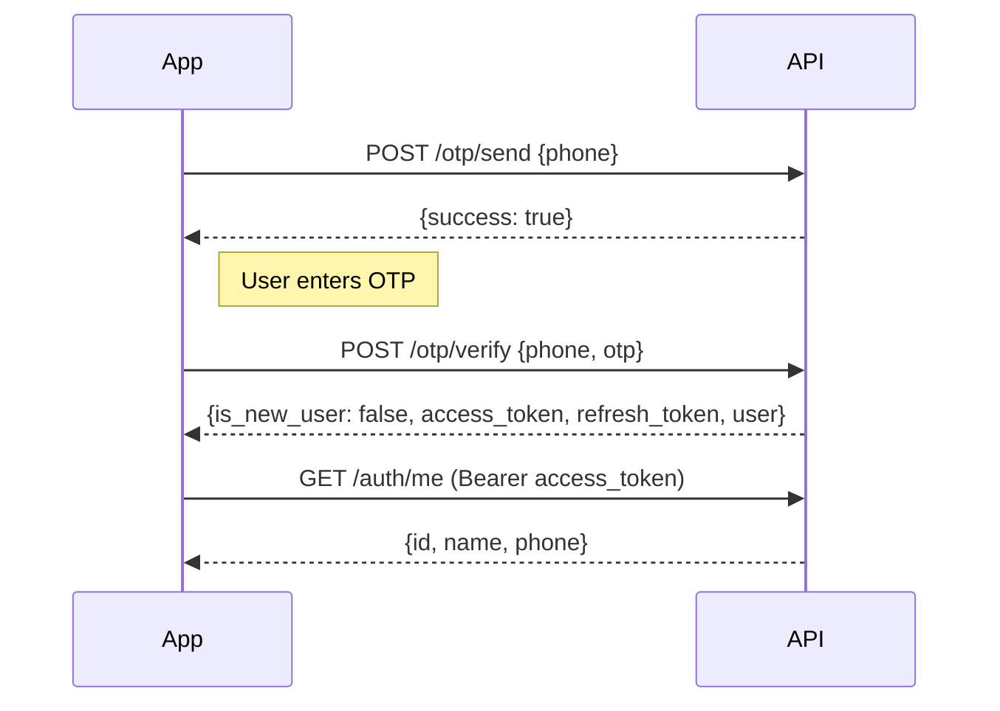
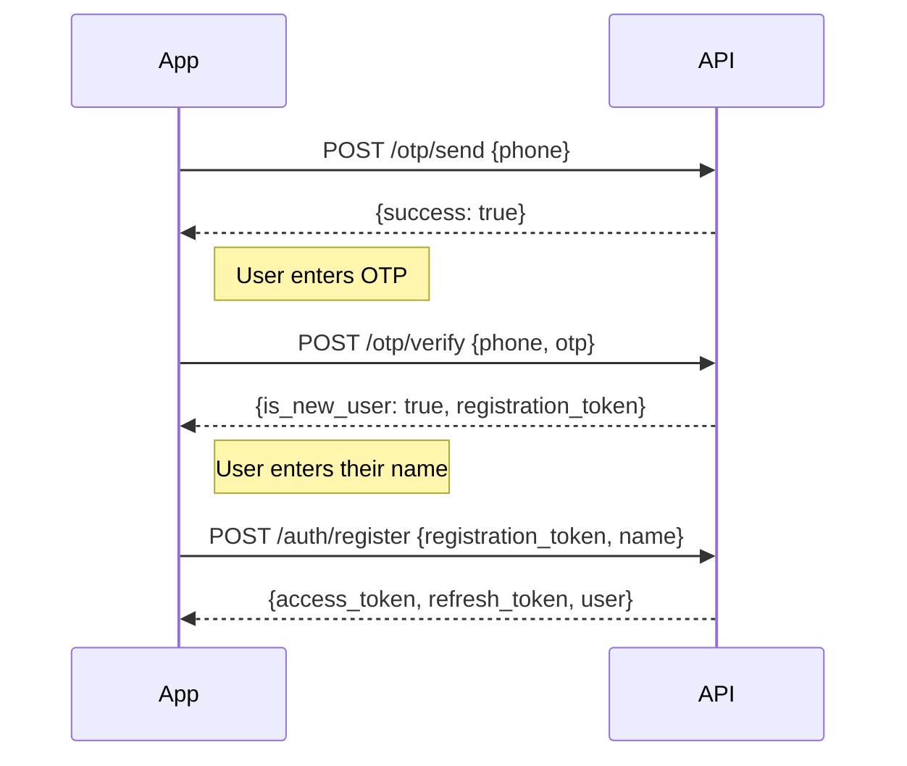
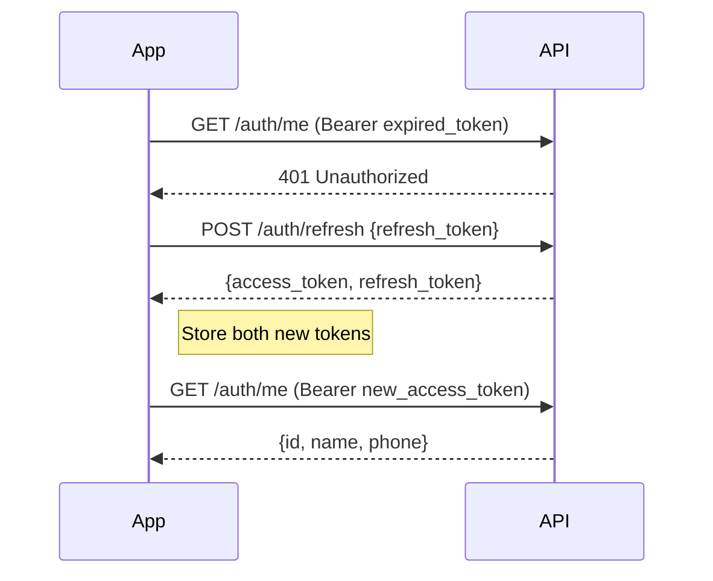

# Integration Guide

Phone-based OTP authentication with JWT tokens for headless applications. This guide covers everything you need to integrate the API into your mobile or web app.

## Overview

The API provides phone number authentication via one-time passwords (OTP). Users verify their phone number, then receive JWT tokens for authenticated API access.

**Base URL:** `https://your-site.com/wp-json/headless-otp-auth/v1`

If the site uses plain permalinks, the base URL is instead:
`https://your-site.com/?rest_route=/headless-otp-auth/v1`

All requests use JSON. Set `Content-Type: application/json` for POST requests.

## Quick Start

**1. Send an OTP to the user's phone:**

```bash
curl -X POST https://your-site.com/wp-json/headless-otp-auth/v1/otp/send \
  -H "Content-Type: application/json" \
  -d '{"phone": "+919876543210"}'
```

**2. Verify the OTP:**

```bash
curl -X POST https://your-site.com/wp-json/headless-otp-auth/v1/otp/verify \
  -H "Content-Type: application/json" \
  -d '{"phone": "+919876543210", "otp": "123456"}'
```

**3. Use the access token for authenticated requests:**

```bash
curl https://your-site.com/wp-json/headless-otp-auth/v1/auth/me \
  -H "Authorization: Bearer eyJ..."
```

That's it for existing users. New users get a `registration_token` at step 2 and need one extra call to `/auth/register`.

## Auth Flows

### Login (Existing User)



### Registration (New User)



The registration token is valid for **10 minutes**. If registration is disabled by the site admin, `/otp/verify` returns `{is_new_user: true, registration_disabled: true}` instead.

### Token Refresh



Both tokens are rotated on refresh. Always replace the old refresh token with the new one.

## API Reference

### POST `/otp/send`

Send an OTP to a phone number.

**Authentication:** None

**Request Body:**

| Parameter | Type | Required | Description |
|-----------|------|----------|-------------|
| `phone` | string | Yes | Phone number in E.164 format (e.g., `+919876543210`) |

**Success Response (200):**

```json
{
  "success": true,
  "message": "OTP sent successfully."
}
```

When **Test Mode** is enabled (admin setting), the OTP is not delivered externally. The response message changes to `"OTP generated in test mode."` and the OTP can be viewed in the admin settings page.

**Errors:**

| Code | Status | When |
|------|--------|------|
| `missing_phone` | 400 | Phone number not provided |
| `cooldown_active` | 429 | Resend cooldown active. Response includes `retry_after` (seconds to wait) |
| `too_many_attempts` | 429 | Rate limit exceeded. Wait for the rate limit window to expire |
| `otp_not_configured` | 500 | OTP delivery server URL is not configured |
| `otp_send_failed` | 500 | OTP delivery server unreachable |
| `otp_send_failed` | 502 | OTP delivery server returned an error |

**Example:**

```bash
curl -X POST https://your-site.com/wp-json/headless-otp-auth/v1/otp/send \
  -H "Content-Type: application/json" \
  -d '{"phone": "+919876543210"}'
```

---

### POST `/otp/verify`

Verify an OTP. Returns JWT tokens for existing users, or a registration token for new users.

**Authentication:** None

**Request Body:**

| Parameter | Type | Required | Description |
|-----------|------|----------|-------------|
| `phone` | string | Yes | Same phone number used in `/otp/send` |
| `otp` | string | Yes | The OTP received by the user |

**Success Response — Existing User (200):**

```json
{
  "is_new_user": false,
  "access_token": "eyJ...",
  "refresh_token": "eyJ...",
  "user": {
    "id": 123,
    "name": "John Doe",
    "phone": "+919876543210"
  }
}
```

**Success Response — New User, Registration Enabled (200):**

```json
{
  "is_new_user": true,
  "registration_token": "a1b2c3d4..."
}
```

The `registration_token` is valid for 10 minutes. Use it with `/auth/register`.

**Success Response — New User, Registration Disabled (200):**

```json
{
  "is_new_user": true,
  "registration_disabled": true,
  "message": "New user registration is currently disabled."
}
```

**Errors:**

| Code | Status | When |
|------|--------|------|
| `missing_params` | 400 | Phone or OTP not provided |
| `otp_expired` | 400 | OTP has expired or was never sent |
| `invalid_otp` | 400 | Wrong OTP code |
| `too_many_verify_attempts` | 429 | Too many wrong guesses (default: 3). The OTP is invalidated — request a new one |
| `config_error` | 403 | JWT secret key is not configured on the server |

**Example:**

```bash
curl -X POST https://your-site.com/wp-json/headless-otp-auth/v1/otp/verify \
  -H "Content-Type: application/json" \
  -d '{"phone": "+919876543210", "otp": "123456"}'
```

---

### POST `/auth/register`

Register a new user with a registration token from `/otp/verify`.

**Authentication:** None (requires valid registration token)

**Request Body:**

| Parameter | Type | Required | Description |
|-----------|------|----------|-------------|
| `registration_token` | string | Yes | Token from `/otp/verify` response |
| `name` | string | Yes | Display name for the new account |

**Success Response (200):**

```json
{
  "access_token": "eyJ...",
  "refresh_token": "eyJ...",
  "user": {
    "id": 456,
    "name": "Jane Smith",
    "phone": "+919876543210"
  }
}
```

**Errors:**

| Code | Status | When |
|------|--------|------|
| `missing_params` | 400 | Registration token or name not provided |
| `invalid_token` | 400 | Token is invalid or expired (10-minute limit) |
| `registration_disabled` | 403 | Site admin has disabled new registrations |
| `config_error` | 403 | JWT secret key is not configured on the server |
| `user_exists` | 409 | Account already exists with this phone number |
| `registration_failed` | 500 | Server error during account creation |

**Example:**

```bash
curl -X POST https://your-site.com/wp-json/headless-otp-auth/v1/auth/register \
  -H "Content-Type: application/json" \
  -d '{"registration_token": "a1b2c3d4...", "name": "Jane Smith"}'
```

---

### POST `/auth/refresh`

Get new access and refresh tokens using a valid refresh token.

**Authentication:** None (requires valid refresh token)

**Request Body:**

| Parameter | Type | Required | Description |
|-----------|------|----------|-------------|
| `refresh_token` | string | Yes | The refresh token from a previous login/refresh |

**Success Response (200):**

```json
{
  "access_token": "eyJ...",
  "refresh_token": "eyJ..."
}
```

Both tokens are new. Store the new refresh token — the old one is invalidated.

**Errors:**

| Code | Status | When |
|------|--------|------|
| `missing_token` | 400 | Refresh token not provided |
| `invalid_token` | 400 | Token format invalid, wrong type, or issuer mismatch |
| `invalid_token` | 401 | Signature verification failed or token revoked |
| `token_expired` | 401 | Refresh token has expired |
| `config_error` | 403 | JWT secret key is not configured on the server |

**Example:**

```bash
curl -X POST https://your-site.com/wp-json/headless-otp-auth/v1/auth/refresh \
  -H "Content-Type: application/json" \
  -d '{"refresh_token": "eyJ..."}'
```

---

### GET `/auth/me`

Get the authenticated user's profile.

**Authentication:** Required — `Authorization: Bearer <access_token>` header

**Success Response (200):**

```json
{
  "id": 123,
  "name": "John Doe",
  "phone": "+919876543210"
}
```

**Errors:**

| Code | Status | When |
|------|--------|------|
| `not_authenticated` | 401 | No valid access token provided |

**Example:**

```bash
curl https://your-site.com/wp-json/headless-otp-auth/v1/auth/me \
  -H "Authorization: Bearer eyJ..."
```

## Error Reference

All errors follow this format:

```json
{
  "code": "error_code",
  "message": "Human-readable description.",
  "data": {
    "status": 400
  }
}
```

Some errors include extra fields in `data` (e.g., `retry_after` for cooldown errors).

### Complete Error Code Table

| Code | Status | Endpoint | Cause | Resolution |
|------|--------|----------|-------|------------|
| `missing_phone` | 400 | /otp/send | Phone number not in request body | Include `phone` field |
| `cooldown_active` | 429 | /otp/send | Sent too recently | Wait `retry_after` seconds (in response `data`) |
| `too_many_attempts` | 429 | /otp/send | Exceeded send limit for this number | Wait for rate limit window to expire (default: 15 min) |
| `otp_not_configured` | 500 | /otp/send | OTP server URL not configured | Contact site admin — server URL must be set in plugin settings |
| `otp_send_failed` | 500 | /otp/send | Cannot reach OTP delivery server | Contact site admin — server URL may be misconfigured |
| `otp_send_failed` | 502 | /otp/send | OTP server returned an error | Contact site admin — check server API key and endpoint |
| `missing_params` | 400 | /otp/verify | Phone or OTP missing | Include both `phone` and `otp` fields |
| `otp_expired` | 400 | /otp/verify | OTP expired or never sent | Request a new OTP via `/otp/send` |
| `invalid_otp` | 400 | /otp/verify | Wrong OTP code | Re-enter the correct code. Limited attempts before lockout |
| `too_many_verify_attempts` | 429 | /otp/verify | Too many wrong guesses | OTP is invalidated. Request a new one via `/otp/send` |
| `missing_params` | 400 | /auth/register | Token or name missing | Include both `registration_token` and `name` fields |
| `invalid_token` | 400 | /auth/register | Registration token expired or invalid | Token is valid for 10 minutes. Re-verify via `/otp/verify` |
| `registration_disabled` | 403 | /auth/register | Site admin disabled registration | Contact site admin to enable registration |
| `user_exists` | 409 | /auth/register | Phone number already has an account | Use `/otp/verify` to log in instead |
| `registration_failed` | 500 | /auth/register | Server error creating account | Retry or contact site admin |
| `missing_token` | 400 | /auth/refresh | Refresh token not in request body | Include `refresh_token` field |
| `invalid_token` | 400 | /auth/refresh | Token malformed or wrong type | Ensure you're using the refresh token, not the access token |
| `invalid_token` | 401 | /auth/refresh | Signature invalid or token revoked | Re-authenticate via `/otp/send` + `/otp/verify` |
| `token_expired` | 401 | /auth/refresh | Refresh token has expired | Re-authenticate via `/otp/send` + `/otp/verify` |
| `config_error` | 403 | /otp/verify | JWT secret key not configured | Contact site admin |
| `config_error` | 403 | /auth/register | JWT secret key not configured | Contact site admin |
| `config_error` | 403 | /auth/refresh | JWT secret key not configured | Contact site admin |
| `not_authenticated` | 401 | /auth/me | No valid access token | Include `Authorization: Bearer <token>` header. Refresh if expired |

## Token Management

### JWT Structure

Tokens are signed with HS256 (HMAC-SHA256). The payload contains:

| Claim | Description |
|-------|-------------|
| `iss` | Issuer — the site URL |
| `sub` | Subject — user ID (integer) |
| `iat` | Issued at — Unix timestamp |
| `exp` | Expiration — Unix timestamp |
| `type` | `"access"` or `"refresh"` |

### Access vs Refresh Tokens

| | Access Token | Refresh Token |
|---|---|---|
| **Purpose** | Authenticate API requests | Get new tokens |
| **Default expiry** | 1 hour (3600s) | 7 days (604800s) |
| **Send as** | `Authorization: Bearer <token>` header | Request body to `/auth/refresh` |
| **On expiry** | Use refresh token to get a new one | Re-authenticate with OTP |

### Refresh Strategy

1. **Decode the access token** (base64, no verification needed) and check `exp` before making requests
2. **If expired**, call `/auth/refresh` with your stored refresh token
3. **Store both new tokens** — the old refresh token is invalidated
4. **If refresh fails** with 401, the user must re-authenticate with OTP
5. **Handle 401 reactively** — if any API call returns 401, attempt a refresh before prompting the user

### Token Storage Recommendations

| Platform | Recommended Storage |
|----------|-------------------|
| iOS | Keychain Services |
| Android | EncryptedSharedPreferences |
| React Native | expo-secure-store or react-native-keychain |
| Flutter | flutter_secure_storage |
| Web (SPA) | Memory (variable) — avoid localStorage for access tokens |

Never store tokens in plain text, localStorage (web), or SharedPreferences (Android).

## Rate Limiting

### OTP Send Limits

| Limit | Default | Behavior |
|-------|---------|----------|
| Resend cooldown | 60 seconds | Must wait between sends. Error includes `retry_after` field |
| Max send attempts | 3 per window | Blocked after 3 sends to the same number |
| Rate limit window | 15 minutes | Send counter resets after this period |

### OTP Verify Limits

| Limit | Default | Behavior |
|-------|---------|----------|
| Max wrong guesses | 3 | OTP is **deleted** after 3 wrong attempts |

After lockout, the user must request a new OTP via `/otp/send`.

### Handling Rate Limits

Check for HTTP 429 responses. For `cooldown_active` errors, use the `retry_after` field:

```json
{
  "code": "cooldown_active",
  "message": "Please wait before requesting another OTP.",
  "data": { "status": 429, "retry_after": 45 }
}
```

Show a countdown timer or disable the "Resend" button for `retry_after` seconds.

## CORS

For browser-based apps, the site admin must add your domain to the **Allowed Origins** setting.

Example: `https://myapp.com,https://staging.myapp.com`

The server sets these headers for allowed origins:

```
Access-Control-Allow-Origin: https://myapp.com
Access-Control-Allow-Headers: Authorization, Content-Type
Access-Control-Allow-Methods: GET, POST, OPTIONS
Access-Control-Allow-Credentials: true
```

Notes:
- Origins must be exact matches (no wildcards)
- Include the protocol (`https://`)
- Ports must match exactly (`https://localhost:3000` is different from `https://localhost:5173`)
- Native mobile apps don't need CORS configuration — this is only for browser requests

## Code Example

Complete JavaScript auth flow using the Fetch API:

```javascript
const API_BASE = 'https://your-site.com/wp-json/headless-otp-auth/v1';

// Storage helpers — replace with secure storage for your platform
let accessToken = null;
let refreshToken = null;

async function apiCall(path, options = {}) {
  const res = await fetch(`${API_BASE}${path}`, {
    headers: { 'Content-Type': 'application/json', ...options.headers },
    ...options,
  });
  const data = await res.json();
  if (!res.ok) throw { status: res.status, ...data };
  return data;
}

// Step 1: Send OTP
async function sendOtp(phone) {
  return apiCall('/otp/send', {
    method: 'POST',
    body: JSON.stringify({ phone }),
  });
}

// Step 2: Verify OTP
async function verifyOtp(phone, otp) {
  const data = await apiCall('/otp/verify', {
    method: 'POST',
    body: JSON.stringify({ phone, otp }),
  });

  if (!data.is_new_user) {
    // Existing user — store tokens
    accessToken = data.access_token;
    refreshToken = data.refresh_token;
  }

  return data;
}

// Step 3 (new users only): Register
async function register(registrationToken, name) {
  const data = await apiCall('/auth/register', {
    method: 'POST',
    body: JSON.stringify({ registration_token: registrationToken, name }),
  });

  accessToken = data.access_token;
  refreshToken = data.refresh_token;
  return data;
}

// Refresh tokens
async function refresh() {
  const data = await apiCall('/auth/refresh', {
    method: 'POST',
    body: JSON.stringify({ refresh_token: refreshToken }),
  });

  accessToken = data.access_token;
  refreshToken = data.refresh_token;
  return data;
}

// Authenticated request with auto-refresh
async function authenticatedFetch(path, options = {}) {
  const makeRequest = () =>
    apiCall(path, {
      ...options,
      headers: { ...options.headers, Authorization: `Bearer ${accessToken}` },
    });

  try {
    return await makeRequest();
  } catch (err) {
    if (err.status === 401 && refreshToken) {
      await refresh();
      return makeRequest();
    }
    throw err;
  }
}

// Usage
async function login(phone, otp) {
  const result = await verifyOtp(phone, otp);

  if (result.is_new_user) {
    if (result.registration_disabled) {
      throw new Error('Registration is disabled.');
    }
    // Prompt user for their name, then:
    // await register(result.registration_token, name);
    return { needsRegistration: true, registrationToken: result.registration_token };
  }

  return { user: result.user };
}

// Get user profile (auto-refreshes if token expired)
async function getProfile() {
  return authenticatedFetch('/auth/me');
}
```

## Testing

### Test Mode

The plugin has a built-in test mode for development. When enabled by the site admin (OTP tab in settings), OTPs are **not delivered** to the external server. Instead, the generated OTP is stored internally and can be retrieved via the admin-only endpoint below.

The `/otp/send` response changes to `{"success": true, "message": "OTP generated in test mode."}`. The `/otp/verify` endpoint works identically — use the OTP from the test endpoint to complete verification.

Rate limiting still applies in test mode to ensure you're testing the full production flow.

### GET `/otp/test-otp`

Retrieve the latest test-mode OTP. **Admin-only** — requires WordPress `manage_options` capability.

**Authentication:** Required — WordPress admin cookie or application password

**Response — Test Mode Off:**

```json
{
  "test_mode": false
}
```

**Response — Test Mode On, OTP Available:**

```json
{
  "test_mode": true,
  "otp": "123456",
  "phone": "+919876543210",
  "created_at": 1740000000
}
```

**Response — Test Mode On, No OTP Generated Yet:**

```json
{
  "test_mode": true,
  "otp": null
}
```

The OTP expires at the same rate as normal OTPs (default: 5 minutes).

> **Warning:** Never use admin credentials or this endpoint in a production client-side application. This endpoint is for development and automated testing only.
