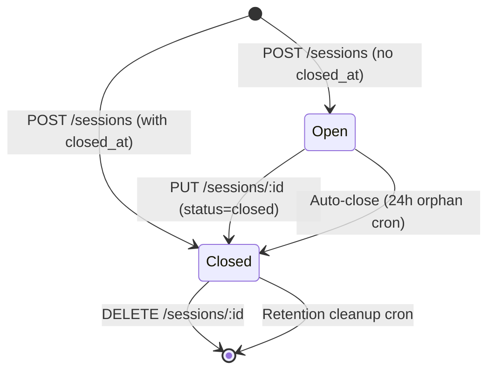

# Integration Guide

Headless POS Sessions provides a REST API for managing point-of-sale register sessions from a headless frontend. Sessions track cash register open/close events, cash movements, order history, and cashier assignments.

## Overview

```
POS Frontend (React, etc.)              WordPress + WooCommerce
────────────────────────────            ──────────────────────────────
POST /sessions  ──────────────────────→ Create session (open register)
GET  /sessions  ──────────────────────→ List sessions (shift history)
GET  /sessions/:id  ──────────────────→ Get session details
PUT  /sessions/:id  ──────────────────→ Update session (close register)
DELETE /sessions/:id  ────────────────→ Delete session (admin cleanup)
```

**Base URL:** `https://your-site.com/wp-json/headless-pos-sessions/v1`

If the site uses plain permalinks: `https://your-site.com/?rest_route=/headless-pos-sessions/v1`

---

## Authentication

All session endpoints require WooCommerce capabilities:

- **CRUD operations** (`manage_shop_orders`): Shop Manager or Administrator
- **Delete** (`manage_woocommerce`): Administrator only

Authentication methods:

1. **Cookie + Nonce** (same-origin): Pass `X-WP-Nonce` header with a valid WordPress nonce
2. **Application Passwords** (cross-origin): Use HTTP Basic Auth with a WordPress Application Password

```bash
# Cookie + Nonce (same-origin)
curl -H "X-WP-Nonce: $NONCE" -H "Cookie: $COOKIES" \
  https://your-site.com/wp-json/headless-pos-sessions/v1/sessions

# Application Passwords (cross-origin)
curl -u "admin:xxxx xxxx xxxx xxxx xxxx xxxx" \
  https://your-site.com/wp-json/headless-pos-sessions/v1/sessions
```

---

## Quick Start

### 1. Open a register session

```bash
curl -X POST https://your-site.com/wp-json/headless-pos-sessions/v1/sessions \
  -H "Content-Type: application/json" \
  -H "X-WP-Nonce: $NONCE" \
  -d '{
    "session_uuid": "550e8400-e29b-41d4-a716-446655440000",
    "terminal_id": "register-01",
    "opened_at": "2026-04-01T09:00:00.000Z",
    "opening_balance": 200.00
  }'
```

### 2. List today's sessions

```bash
curl "https://your-site.com/wp-json/headless-pos-sessions/v1/sessions?date_from=2026-04-01T00:00:00.000Z&status=open" \
  -H "X-WP-Nonce: $NONCE"
```

### 3. Close the register

```bash
curl -X PUT https://your-site.com/wp-json/headless-pos-sessions/v1/sessions/42 \
  -H "Content-Type: application/json" \
  -H "X-WP-Nonce: $NONCE" \
  -d '{
    "status": "closed",
    "closed_at": "2026-04-01T17:30:00.000Z",
    "closing_balance": 485.50,
    "expected_balance": 490.00,
    "cash_in": 340.00,
    "cash_out": 50.00,
    "order_count": 15,
    "order_ids": [1001, 1002, 1003],
    "notes": "Short $4.50 — suspect miscounted change"
  }'
```

---

## API Reference

### POST /sessions

Create a new POS session. Returns 409 if a session with the same `session_uuid` already exists (idempotent).

#### Request Body

| Field | Type | Required | Description |
|-------|------|----------|-------------|
| `session_uuid` | string | Yes | Unique identifier for the session (UUID v4 recommended) |
| `terminal_id` | string | Yes | Identifier for the POS terminal/register |
| `opened_at` | string | Yes | ISO 8601 datetime when the register was opened |
| `opening_balance` | number | No | Starting cash amount (must be >= 0, default: 0) |
| `closed_at` | string | No | ISO 8601 datetime when the register was closed. If omitted, session status is `open` |
| `closing_balance` | number | No | Ending cash amount (default: 0) |
| `expected_balance` | number | No | Expected closing balance based on transactions (default: 0) |
| `cash_in` | number | No | Total cash received during the session (default: 0) |
| `cash_out` | number | No | Total cash paid out during the session (default: 0) |
| `order_count` | number | No | Number of orders processed (default: 0) |
| `order_ids` | number[] | No | Array of WooCommerce order IDs (default: []) |
| `notes` | string | No | Free-text notes about the session |
| `cashier_id` | number | No | WordPress user ID. Defaults to the authenticated user |

#### Success Response (200)

```json
{
  "id": 42,
  "session_uuid": "550e8400-e29b-41d4-a716-446655440000",
  "terminal_id": "register-01",
  "status": "open",
  "opened_at": "2026-04-01T09:00:00.000Z",
  "closed_at": "",
  "opening_balance": 200.0,
  "closing_balance": 0,
  "expected_balance": 0,
  "cash_in": 0,
  "cash_out": 0,
  "order_count": 0,
  "order_ids": [],
  "notes": "",
  "cashier_id": 1,
  "created_at": "2026-04-01 09:00:00"
}
```

#### Error Responses

| Status | Code | Description |
|--------|------|-------------|
| 400 | `missing_session_uuid` | `session_uuid` field is required |
| 400 | `missing_terminal_id` | `terminal_id` field is required |
| 400 | `missing_opened_at` | `opened_at` field is required |
| 400 | `invalid_opening_balance` | `opening_balance` must be >= 0 |
| 400 | `invalid_order_ids` | `order_ids` must be an array of integers |
| 409 | `duplicate_uuid` | A session with this `session_uuid` already exists |
| 409 | `max_open_exceeded` | Maximum number of open sessions reached |

---

### GET /sessions

List sessions with pagination, filtering, and sorting.

#### Query Parameters

| Parameter | Type | Default | Description |
|-----------|------|---------|-------------|
| `page` | number | `1` | Page number |
| `per_page` | number | `20` | Results per page (1–100) |
| `status` | string | — | Filter by session status: `open` or `closed` |
| `terminal_id` | string | — | Filter by terminal ID |
| `date_from` | string | — | Filter sessions opened on or after this ISO 8601 datetime |
| `date_to` | string | — | Filter sessions opened on or before this ISO 8601 datetime |
| `orderby` | string | `opened_at` | Sort field: `opened_at`, `closed_at`, or `order_count` |
| `order` | string | `desc` | Sort direction: `asc` or `desc` |

#### Success Response (200)

```json
{
  "data": [
    {
      "id": 42,
      "session_uuid": "550e8400-e29b-41d4-a716-446655440000",
      "terminal_id": "register-01",
      "status": "closed",
      "opened_at": "2026-04-01T09:00:00.000Z",
      "closed_at": "2026-04-01T17:30:00.000Z",
      "opening_balance": 200.0,
      "closing_balance": 485.5,
      "expected_balance": 490.0,
      "cash_in": 340.0,
      "cash_out": 50.0,
      "order_count": 15,
      "order_ids": [1001, 1002, 1003],
      "notes": "Short $4.50",
      "cashier_id": 1,
      "created_at": "2026-04-01 09:00:00"
    }
  ],
  "meta": {
    "total": 47,
    "total_pages": 3,
    "page": 1,
    "per_page": 20
  }
}
```

#### Example

```bash
# Open sessions for register-01, sorted by newest first
curl "https://your-site.com/wp-json/headless-pos-sessions/v1/sessions?status=open&terminal_id=register-01&orderby=opened_at&order=desc" \
  -H "X-WP-Nonce: $NONCE"
```

---

### GET /sessions/:id

Fetch a single session by its WordPress post ID.

#### Success Response (200)

Returns the same session object as POST /sessions.

#### Error Response

| Status | Code | Description |
|--------|------|-------------|
| 404 | `not_found` | Session not found |

---

### PUT /sessions/:id

Partial update — only provided fields are modified. Commonly used to close a session or update cash totals.

#### Request Body

All fields from POST /sessions are accepted (except `session_uuid`). Only include the fields you want to update.

| Field | Type | Description |
|-------|------|-------------|
| `status` | string | Set to `closed` to close the session |
| `closed_at` | string | ISO 8601 datetime when the register was closed |
| `closing_balance` | number | Ending cash amount |
| `expected_balance` | number | Expected closing balance |
| `cash_in` | number | Total cash received |
| `cash_out` | number | Total cash paid out |
| `order_count` | number | Number of orders processed |
| `order_ids` | number[] | Array of WooCommerce order IDs |
| `notes` | string | Free-text notes |
| `terminal_id` | string | Terminal identifier |
| `cashier_id` | number | WordPress user ID |

#### Success Response (200)

Returns the full updated session object.

#### Error Responses

| Status | Code | Description |
|--------|------|-------------|
| 404 | `not_found` | Session not found |
| 409 | `max_open_exceeded` | Cannot reopen — max open sessions reached |

#### Example

```bash
# Close a session
curl -X PUT https://your-site.com/wp-json/headless-pos-sessions/v1/sessions/42 \
  -H "Content-Type: application/json" \
  -H "X-WP-Nonce: $NONCE" \
  -d '{"status": "closed", "closed_at": "2026-04-01T17:30:00.000Z", "closing_balance": 485.50}'
```

---

### DELETE /sessions/:id

Permanently delete a session and all its metadata. Requires `manage_woocommerce` capability (Administrator only).

#### Success Response (200)

```json
{
  "deleted": true,
  "id": 42
}
```

#### Error Responses

| Status | Code | Description |
|--------|------|-------------|
| 404 | `not_found` | Session not found |
| 500 | `delete_failed` | Failed to delete session |

---

### GET /settings

Fetch plugin settings. Requires `manage_options` capability.

#### Success Response (200)

```json
{
  "retention_days": 90,
  "max_open_sessions": 10
}
```

---

### POST /settings

Update plugin settings. Requires `manage_options` capability.

#### Request Body

| Field | Type | Default | Description |
|-------|------|---------|-------------|
| `retention_days` | number | `90` | Auto-delete closed sessions older than N days (0 = disabled) |
| `max_open_sessions` | number | `10` | Maximum concurrent open sessions |

#### Success Response (200)

Returns the updated settings object.

---

## Session Lifecycle



A session is **open** when created without a `closed_at` timestamp. It transitions to **closed** when:

1. The frontend sends a PUT with `status: "closed"` and `closed_at`
2. The daily auto-close cron closes orphaned sessions open for more than 24 hours

Closed sessions are automatically deleted after the configured retention period (default: 90 days).

---

## Error Reference

| Code | Status | Description |
|------|--------|-------------|
| `missing_session_uuid` | 400 | `session_uuid` is required |
| `missing_terminal_id` | 400 | `terminal_id` is required |
| `missing_opened_at` | 400 | `opened_at` is required |
| `invalid_opening_balance` | 400 | `opening_balance` must be >= 0 |
| `invalid_order_ids` | 400 | `order_ids` must be an array of integers |
| `duplicate_uuid` | 409 | A session with this UUID already exists |
| `max_open_exceeded` | 409 | Maximum number of open sessions reached |
| `not_found` | 404 | Session not found |
| `create_failed` | 500 | Failed to create session |
| `delete_failed` | 500 | Failed to delete session |

All errors follow the WordPress REST API error format:

```json
{
  "code": "duplicate_uuid",
  "message": "A session with this session_uuid already exists.",
  "data": { "status": 409 }
}
```

---

## TypeScript Example

A session manager for a React POS frontend:

```ts
// lib/pos-sessions.ts

const BASE = '/wp-json/headless-pos-sessions/v1';

interface Session {
  id: number;
  session_uuid: string;
  terminal_id: string;
  status: 'open' | 'closed';
  opened_at: string;
  closed_at: string;
  opening_balance: number;
  closing_balance: number;
  expected_balance: number;
  cash_in: number;
  cash_out: number;
  order_count: number;
  order_ids: number[];
  notes: string;
  cashier_id: number;
  created_at: string;
}

interface SessionList {
  data: Session[];
  meta: { total: number; total_pages: number; page: number; per_page: number };
}

async function request<T>(path: string, init?: RequestInit): Promise<T> {
  const res = await fetch(`${BASE}${path}`, {
    ...init,
    headers: {
      'Content-Type': 'application/json',
      'X-WP-Nonce': window.wpApiSettings?.nonce ?? '',
      ...init?.headers,
    },
  });
  if (!res.ok) {
    const err = await res.json();
    throw new Error(err.message ?? `HTTP ${res.status}`);
  }
  return res.json();
}

/** Open a new register session */
export function openSession(terminalId: string, openingBalance: number) {
  return request<Session>('/sessions', {
    method: 'POST',
    body: JSON.stringify({
      session_uuid: crypto.randomUUID(),
      terminal_id: terminalId,
      opened_at: new Date().toISOString(),
      opening_balance: openingBalance,
    }),
  });
}

/** Close an existing session */
export function closeSession(
  id: number,
  data: { closing_balance: number; cash_in: number; cash_out: number; order_ids?: number[]; notes?: string },
) {
  return request<Session>(`/sessions/${id}`, {
    method: 'PUT',
    body: JSON.stringify({
      ...data,
      status: 'closed',
      closed_at: new Date().toISOString(),
      order_count: data.order_ids?.length ?? 0,
    }),
  });
}

/** List sessions with optional filters */
export function listSessions(params?: Record<string, string>) {
  const qs = params ? '?' + new URLSearchParams(params).toString() : '';
  return request<SessionList>(`/sessions${qs}`);
}

/** Get a single session */
export function getSession(id: number) {
  return request<Session>(`/sessions/${id}`);
}

/** Delete a session (admin only) */
export function deleteSession(id: number) {
  return request<{ deleted: boolean; id: number }>(`/sessions/${id}`, {
    method: 'DELETE',
  });
}
```

Usage in a React component:

```tsx
import { openSession, closeSession, listSessions } from '@/lib/pos-sessions';

// Open register
const session = await openSession('register-01', 200.00);

// List today's open sessions
const { data, meta } = await listSessions({
  status: 'open',
  date_from: new Date().toISOString().split('T')[0] + 'T00:00:00.000Z',
});

// Close register
await closeSession(session.id, {
  closing_balance: 485.50,
  cash_in: 340.00,
  cash_out: 50.00,
  order_ids: [1001, 1002, 1003],
  notes: 'Short $4.50',
});
```
